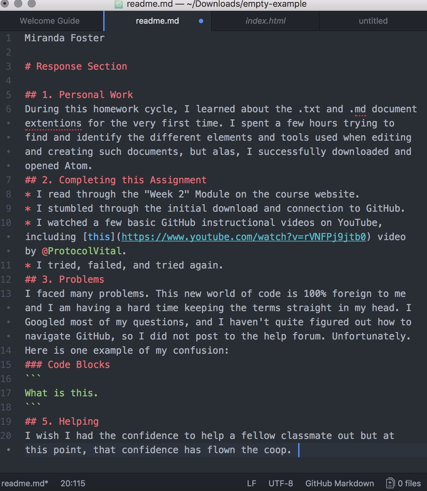

Miranda Foster

# Response Section

## 1. Personal Work
During this homework cycle, I learned about the .txt and .md document extentions for the very first time. I spent a few hours trying to find and identify the different elements and tools used when editing and creating such documents, but alas, I successfully downloaded and opened Atom.
## 2. Completing this Assignment
* I read through the "Week 2" Module on the course website.
* I stumbled through the initial download and connection to GitHub.
* I watched a few basic GitHub instructional videos on YouTube, including [this](https://www.youtube.com/watch?v=rVNFPj9jtb0) video by @ProtocolVital.
* I tried, failed, and tried again.
## 3. Problems
I faced many problems. This new world of code is 100% foreign to me and I am having a hard time keeping the terms straight in my head. I Googled most of my questions, and I haven't quite figured out how to navigate GitHub, so I did not post to the help forum. Unfortunately.
Here is one example of my confusion:
### Code Blocks
```
What is this.
```
## 5. Helping
I wish I had the confidence to help a fellow classmate out but at this point, that confidence has flown the coop.


