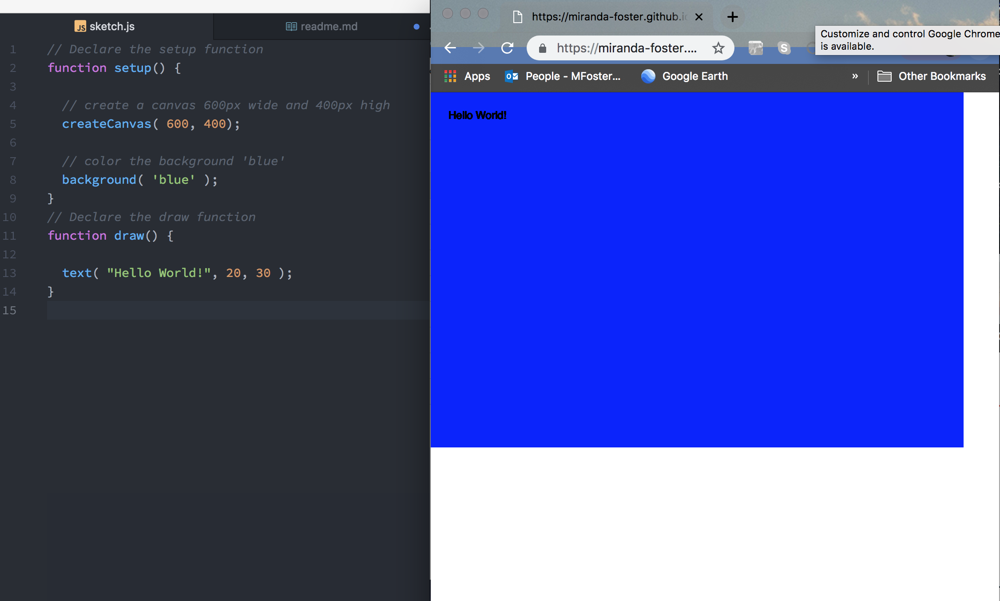

# Week 3 Response
### 1. I learned how to launch my first webpage this week. It was satisfying to see the dots connect, finally!

### 2. I worked through my coding issues with my pal,
## Daylin Scott
<<<<<<< HEAD
### 3. This is what my sketch looked like:

=======
### 3. This is what my sketch looked like: 

>>>>>>> 0f72980449ca54f9dfc2fded7044ca9065b17e3a
